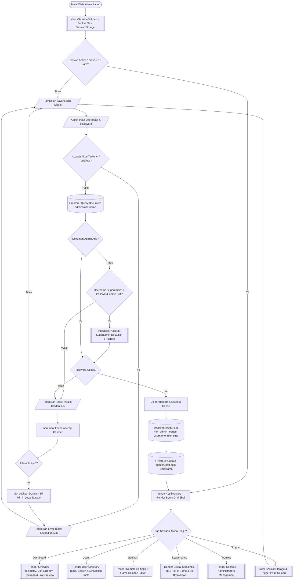

# Flowchart Web Admin Dashboard (Vite + JS - Mathmagic)

## Standar ISO 5807 / ANSI Flowchart Standard

Dokumen ini mendokumentasikan diagram alir (_flowchart_) lengkap untuk aplikasi **Web Admin Dashboard (Vite + Vanilla JS)** proyek **Mathmagic**. Diagram alir ini disusun mengikuti standar internasional **ISO 5807** mengenai simbol, batasan garis masuk/keluar (_inbound/outbound rules_), batasan peran pengguna (_Role-Based Access Control / RBAC_), serta logika utama pada `main.js`.

---

## 📌 Ringkasan Simbol & Kaidah ISO 5807

```text
+-----------------------+-----------------------+--------------------+--------------------+
| Simbol ISO            | Nama Simbol           | Batasan Masuk (In) | Batasan Keluar(Out)|
+-----------------------+-----------------------+--------------------+--------------------+
| ([Mulai / Selesai])   | Terminator            | Start: 0 / End: 1  | Start: 1 / End: 0  |
| [/ Input / Output /]  | Data Input / Output   | Maksimal 1         | Maksimal 1         |
| [   Proses Data   ]   | Process               | Maksimal 1         | Maksimal 1         |
| <  Keputusan ?  >     | Decision (Kriteria)   | Maksimal 1         | Exactly 2 atau 3   |
| [[  Subrutin / API ]] | Predefined Process    | Maksimal 1         | Maksimal 1         |
| [( Firestore DB / Session)] Data Store        | Dibaca / Ditulis oleh Proses               |
| (( Connector (A) ))   | Connector Halaman     | Maksimal 1         | Maksimal 1         |
+-----------------------+-----------------------+--------------------+--------------------+
```

### Rules & Norms:

1. **Arah Utama**: Top-to-Bottom (Atas ke Bawah). Garis alir masuk dari sisi **ATAS** simbol, dan keluar dari sisi **BAWAH** (atau **SAMPING** khusus untuk cabang Decision).
2. **Outdegree Terminator Start**: Tepat 1 garis keluar dari BAWAH. Indegree = 0.
3. **Indegree Terminator End**: Tepat 1 garis masuk dari ATAS. Outdegree = 0.
4. **Outdegree Process & I/O**: Tepat 1 garis keluar dari BAWAH. Indegree = 1 dari ATAS.
5. **Outdegree Decision**: Exactly 2 cabang keluar (misal: `Ya` keluar dari BAWAH, `Tidak` keluar dari SAMPING KANAN/KIRI) yang wajib memiliki label kondisi yang jelas.

---

## 📐 Diagram Alir Utama (Overview Flowchart)

Berikut adalah diagram alir tingkat tinggi (_high-level flowchart_) untuk Web Admin Dashboard:



---

## 🔍 Detail Modul System Flowchart

---

### 1. Modul Inisialisasi Sesi & Autentikasi Admin (`main.js` Login Engine)

Modul ini memproteksi akses dashboard dengan fitur keamanan tingkat lanjut: batas waktu sesi 12 jam, proteksi _brute-force lockout_ (maksimal 5 percobaaan gagal -> terkunci 15 menit), serta _auto-seeding_ akun `superadmin` jika database admin masih kosong.

#### Diagram ISO Standar (ASCII Representation):

```text
               +-----------------------------------+
               |        (START: Access Web)        |
               +-----------------------------------+
                                 | (1 out)
                                 v
               +-----------------------------------+
               | [[ checkSessionOnLoad()         ]]|
               +-----------------------------------+
                                 | (1 out)
                                 v
               +-----------------------------------+
               | < Session Valid (<12 jam) &       |
               |   mm_admin_logged == true? >      |
               +-----------------------------------+
                 | (Ya - bawah)             | (Tidak - samping)
                 v                          v
   +---------------------------+   +-------------------------------+
   | (( A: Render Dashboard )) |   | [/ Tampilkan Form Login Admin/]|
   +---------------------------+   +-------------------------------+
                                            |
                                            v
                                   +-------------------------------+
                                   | [/ Input: Username & Password/]|
                                   +-------------------------------+
                                            |
                                            v
                                   +-------------------------------+
                                   | < Cek Lockout LocalStorage?   |
                                   |   (Date.now() < lockoutUntil) >|
                                   +-------------------------------+
                                     | (Ya)                 | (Tidak)
                                     v                      v
                       +-----------------------+  +----------------+
                       | [/ Toast: Account     |  | [( Firestore:  |
                       |    Locked 15 Min /]   |  |   Get Document |
                       +-----------------------+  |   admins/user )|
                                     |            +----------------+
                                     v                      |
                           (Return to Form)                 v
                                                  +----------------+
                                                  | < Doc Exists? >|
                                                  +----------------+
                                                    | (Ya)   | (Tidak)
                                                    v        v
                                    +------------------+  +-------------------+
                                    | < Match Pass? >  |  | < Superadmin      |
                                    +------------------+  |   Default Check? >|
                                      | (Ya)    | (Tidak) +-------------------+
                                      |         v           | (Ya)     | (Tidak)
                                      |     +----------+    v          v
                                      |     | [Increment| +---------+ +-------+
                                      |     |  Attempt] | |[Seed DB | |[/Toast|
                                      |     +----------+  | Superad]| | Invalid
                                      |          |        +---------+ | Creds/]
                                      |          v             |      +-------+
                                      |     +----------+       |          |
                                      |     | <Attempt |       v          v
                                      |     |   >= 5? >|  (Proceed) (Return)
                                      |     +----------+
                                      |       |(Ya) |(Tidak)
                                      |       v     v
                                      |   +-----+ +-------+
                                      |   |[Lock| |[/Toast|
                                      |   |15m ]| | Remn/]|
                                      |   +-----+ +-------+
                                      v
                       +-----------------------------------+
                       | [Clear Lockout & Store Session    |
                       |  Storage: logged, username, role] |
                       +-----------------------------------+
                                 |
                                 v
                       +-----------------------------------+
                       | [( Firestore: Update lastLogin )] |
                       +-----------------------------------+
                                 |
                                 v
                       +-----------------------------------+
                       | (( A: Render Dashboard Shell ))   |
                       +-----------------------------------+
```

---

### 2. Modul Remote Settings & Game Balance Editor (Panel Settings)

Memungkinkan administrator memperbarui parameter game di Firestore (`settings/global`) secara real-time yang langsung berdampak pada seluruh klien Unity. Modul ini dilengkapi proteksi **RBAC (Role-Based Access Control)**.

#### Diagram ISO Standar (ASCII Representation):

```text
                       +---------------------------+
                       | (( Select Tab: Settings ))|
                       +---------------------------+
                                     |
                                     v
                       +---------------------------+
                       | [( Firestore DB: Fetch    |
                       |    settings/global      )]|
                       +---------------------------+
                                     |
                                     v
                       +---------------------------+
                       | < Evaluasi Peran Admin    |
                       |   (loggedInRole)? >       |
                       +---------------------------+
                         | (superadmin)       | (admin biasa)
                         v                    v
           +--------------------------+ +---------------------------+
           | [/ Form Status: Editable | | [/ Form Status: Read-Only |
           |    Simpan Buttons Active/| |    Badge Read-Only Active /]
           +--------------------------+ +---------------------------+
                         |                    |
                         v                    v
           +--------------------------+ +---------------------------+
           | [/ Superadmin Mengubah   | | (Admin Hanya Dapat        |
           |    Nilai Game Balance /] | |  Melihat Nilai Parameter) |
           +--------------------------+ +---------------------------+
                         |                    |
                         v                    v
           +--------------------------+ +---------------------------+
           | [/ Klik Save Balance /   | | (Selesai View Mode)       |
           |    Save Thresholds /]    | +---------------------------+
           +--------------------------+
                         |
                         v
           +--------------------------+
           | [( Firestore DB: Update  |
           |    doc settings/global )]|
           +--------------------------+
                         |
                         v
           +--------------------------+
           | [System Log: Catat       |
           |  Aktivitas ke Console UI]|
           +--------------------------+
                         |
                         v
           +--------------------------+
           | [/ Toast: Settings Saved |
           |    Synced to Unity Client|]
           +--------------------------+
```

---

### 3. Modul User Management & Simulation Tools (Panel Users)

Modul untuk melihat direktori pemain, melakukan pencarian instan, mengedit skor/level/darah, menghapus akun, serta menyimulasikan data dummy (khusus `superadmin`).

#### Diagram ISO Standar (ASCII Representation):

```text
                       +---------------------------+
                       | (( Select Tab: Users ))   |
                       +---------------------------+
                                     |
                                     v
                       +---------------------------+
                       | [( Firestore DB: Subscribe|
                       |    collection users )]    |
                       +---------------------------+
                                     |
                                     v
                       +---------------------------+
                       | [/ Tampilkan Tabel Users: |
                       |    Search & Sorting Bar /]|
                       +---------------------------+
                                     |
                                     v
                       +---------------------------+
                       | < Aksi yang Dipilih       |
                       |   oleh Admin? >           |
                       +---------------------------+
                         | (Search/Sort)      | (Edit / Delete / Simulate)
                         v                    v
           +--------------------------+ +---------------------------+
           | [Filter Data Array Users | | < Tipe Aksi Admin? >      |
           |  & Render Pagination]    | +---------------------------+
           +--------------------------+   | (Edit)  | (Delete)| (Simulate)
                                          v         v         v
                                    +----------+ +--------+ +-------------+
                                    |[/ Modal  | |[/Confirm| |< Check     |
                                    |  Input/  | | Modal/]| |  Superadmin>|
                                    +----------+ +--------+ +-------------+
                                         |            |       |(Ya) |(Tidak)
                                         v            v       v     v
                                    +----------+ +--------+ +---+ +-------+
                                    |[(Update  | |[(Delete| |[Add| |[/Toast|
                                    |  users)] | | doc )] | |doc]| |Restr/] |
                                    +----------+ +--------+ +---+ +-------+
                                         |            |       |
                                         +------------+-------+
                                                      |
                                                      v
                                        +---------------------------+
                                        | [/ Toast Success & Real-  |
                                        |    time UI Auto-Update /] |
                                        +---------------------------+
```

---

### 4. Modul Monitoring Leaderboard & Telemetry (Panel Dashboard & Leaderboard)

Modul ini menampilkan visualisasi analitik permainan dan klasemen skor tertinggi pemain.

#### Diagram ISO Standar (ASCII Representation):

```text
                       +---------------------------+
                       | (( Select Dashboard/Lead))|
                       +---------------------------+
                                     |
                                     v
                       +---------------------------+
                       | [( Firestore DB: Fetch    |
                       |    users order by score )]|
                       +---------------------------+
                                     |
                                     v
                       +---------------------------+
                       | [Hitung Telemetri Metrics:|
                       |  Avg Score, Avg Level,    |
                       |  Peak Concurrency Data]   |
                       +---------------------------+
                                     |
                                     v
                       +---------------------------+
                       | [/ Render Line Chart      |
                       |    Concurrency & Heatmap/]|
                       +---------------------------+
                                     |
                                     v
                       +---------------------------+
                       | [/ Render Hall of Fame    |
                       |    Top 1 & Tier List /]   |
                       +---------------------------+
                                     |
                                     v
                       +---------------------------+
                       | (Dashboard Display Active)|
                       +---------------------------+
```

---

### 5. Modul Logout & Destruction Sesi

Proses untuk mengakhiri sesi autentikasi admin secara aman.

#### Diagram ISO Standar (ASCII Representation):

```text
                       +---------------------------+
                       | [/ Admin Klik Logout /]   |
                       +---------------------------+
                                     |
                                     v
                       +---------------------------+
                       | [( SessionStorage: Clear  |
                       |    mm_admin_logged,       |
                       |    username, role, time )]|
                       +---------------------------+
                                     |
                                     v
                       +---------------------------+
                       | [/ Toast: Logged Out /]   |
                       +---------------------------+
                                     |
                                     v
                       +---------------------------+
                       | [Trigger App Re-render:   |
                       |  renderAppStructure() ]   |
                       +---------------------------+
                                     |
                                     v
                       +---------------------------+
                       | (END: Layar Auth Admin)   |
                       +---------------------------+
```

---

## 📑 Tabel Matriks Verifikasi Standar ISO 5807

| No  | Elemen Logic                    | Simbol ISO         | Aturan Garis Masuk (Inbound) | Aturan Garis Keluar (Outbound) | Keterangan Standar        |
| --- | ------------------------------- | ------------------ | ---------------------------- | ------------------------------ | ------------------------- |
| 1   | Akses Web Admin                 | Terminator Oval    | 0 (None)                     | 1 (Ke BAWAH)                   | Sesuai ISO                |
| 2   | Logout / End Session            | Terminator Oval    | 1 (Dari ATAS)                | 0 (None)                       | Sesuai ISO                |
| 3   | Input Form Login & Settings     | Parallelogram      | 1 (Dari ATAS)                | 1 (Ke BAWAH)                   | Sesuai ISO                |
| 4   | Execution Check Session         | Predefined Process | 1 (Dari ATAS)                | 1 (Ke BAWAH)                   | Sesuai ISO                |
| 5   | Evaluasi Password & Role (RBAC) | Decision (Diamond) | 1 (Dari ATAS)                | 2-3 Cabang (BAWAH & SAMPING)   | Sesuai ISO                |
| 6   | Firestore DB & SessionStorage   | Database / Storage | Dibaca/Ditulis               | Dibaca/Ditulis                 | Sesuai ISO                |
| 7   | Connector Halaman `((A))`       | Connector Circle   | 1                            | 1                              | Memutus penyilangan garis |
