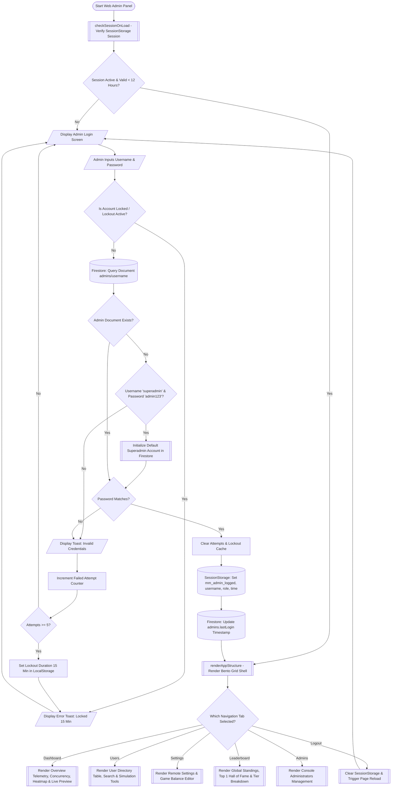

# Web Admin Dashboard Flowchart Documentation (Vite + JS - Mathmagic)

## International ISO 5807 / ANSI Flowchart Standard

This document provides complete flowchart documentation for the **Web Admin Dashboard (Vite + Vanilla JS)** application of the **Mathmagic** project. The flowcharts are structured in compliance with the **ISO 5807** international standard regarding symbol shapes, inbound/outbound line degree constraints, Role-Based Access Control (RBAC) rules, and primary application logic in `main.js`.

---

## 📌 ISO 5807 Symbol Specifications & Conventions

```text
+-----------------------+-----------------------+--------------------+--------------------+
| ISO Symbol            | Symbol Name           | Inbound Limit (In) | Outbound Limit(Out)|
+-----------------------+-----------------------+--------------------+--------------------+
| ([Start / End])       | Terminator            | Start: 0 / End: 1  | Start: 1 / End: 0  |
| [/ Input / Output /]  | Data Input / Output   | Max 1              | Max 1              |
| [   Process Data  ]   | Process               | Max 1              | Max 1              |
| <  Decision ?   >     | Decision (Criteria)   | Max 1              | Exactly 2 or 3     |
| [[  Subroutine / API]]| Predefined Process    | Max 1              | Max 1              |
| [( Firestore / Session)] Data Store           | Read / Written by Process               |
| (( Connector (A) ))   | Page Connector        | Max 1              | Max 1              |
+-----------------------+-----------------------+--------------------+--------------------+
```

### Rules & Conventions:

1. **Primary Direction**: Top-to-Bottom. Inbound lines enter from the **TOP** of symbols, and outbound lines exit from the **BOTTOM** (or **SIDES** specifically for Decision branches).
2. **Start Terminator Outdegree**: Exactly 1 outbound line from the BOTTOM. Indegree = 0.
3. **End Terminator Indegree**: Exactly 1 inbound line from the TOP. Outdegree = 0.
4. **Process & I/O Outdegree**: Exactly 1 outbound line from the BOTTOM. Indegree = 1 from the TOP.
5. **Decision Outdegree**: Exactly 2 exit branches (e.g., `Yes` exits from BOTTOM, `No` exits from RIGHT/LEFT) with clear condition labels.

---

## 📐 Overview Flowchart

The following high-level flowchart outlines the Web Admin Dashboard lifecycle:



---

## 🔍 Modular System Flowchart Details

---

### 1. Session Initialization & Authentication Module (`main.js` Login Engine)

Protects dashboard access with advanced security features: 12-hour session expiration, brute-force lockout protection (5 failed attempts -> 15-minute lock), and auto-seeding of the default `superadmin` account if the admin database is empty.

#### ISO Standard Diagram (ASCII Representation):

```text
               +-----------------------------------+
               |        (START: Access Web)        |
               +-----------------------------------+
                                 | (1 out)
                                 v
               +-----------------------------------+
               | [[ checkSessionOnLoad()         ]]|
               +-----------------------------------+
                                 | (1 out)
                                 v
               +-----------------------------------+
               | < Session Valid (<12h) &          |
               |   mm_admin_logged == true? >      |
               +-----------------------------------+
                 | (Yes - bottom)           | (No - side)
                 v                          v
   +---------------------------+   +-------------------------------+
   | (( A: Render Dashboard )) |   | [/ Display Admin Login Form /]|
   +---------------------------+   +-------------------------------+
                                            |
                                            v
                                   +-------------------------------+
                                   | [/ Input: Username & Password/]|
                                   +-------------------------------+
                                            |
                                            v
                                   +-------------------------------+
                                   | < Check LocalStorage Lockout? |
                                   |   (Date.now() < lockoutUntil) >|
                                   +-------------------------------+
                                     | (Yes)                | (No)
                                     v                      v
                       +-----------------------+  +----------------+
                       | [/ Toast: Account     |  | [( Firestore:  |
                       |    Locked 15 Min /]   |  |   Get Document |
                       +-----------------------+  |   admins/user )|
                                     |            +----------------+
                                     v                      |
                           (Return to Form)                 v
                                                  +----------------+
                                                  | < Doc Exists? >|
                                                  +----------------+
                                                    | (Yes)  | (No)
                                                    v        v
                                    +------------------+  +-------------------+
                                    | < Match Pass? >  |  | < Superadmin      |
                                    +------------------+  |   Default Check? >|
                                      | (Yes)   | (No)    +-------------------+
                                      |         v           | (Yes)    | (No)
                                      |     +----------+    v          v
                                      |     | [Increment| +---------+ +-------+
                                      |     |  Attempt] | |[Seed DB | |[/Toast|
                                      |     +----------+  | Superad]| | Invalid
                                      |          |        +---------+ | Creds/]
                                      |          v             |      +-------+
                                      |     +----------+       |          |
                                      |     | <Attempt |       v          v
                                      |     |   >= 5? >|  (Proceed) (Return)
                                      |     +----------+
                                      |       |(Yes)|(No)
                                      |       v     v
                                      |   +-----+ +-------+
                                      |   |[Lock| |[/Toast|
                                      |   |15m ]| | Remn/]|
                                      |   +-----+ +-------+
                                      v
                       +-----------------------------------+
                       | [Clear Lockout & Store Session    |
                       |  Storage: logged, username, role] |
                       +-----------------------------------+
                                 |
                                 v
                       +-----------------------------------+
                       | [( Firestore: Update lastLogin )] |
                       +-----------------------------------+
                                 |
                                 v
                       +-----------------------------------+
                       | (( A: Render Dashboard Shell ))   |
                       +-----------------------------------+
```

---

### 2. Remote Settings & Game Balance Editor Module (Settings Panel)

Allows administrators to update game balance parameters on Firestore (`settings/global`) in real-time, instantly affecting all active Unity client sessions. Features **Role-Based Access Control (RBAC)** enforcement.

#### ISO Standard Diagram (ASCII Representation):

```text
                       +---------------------------+
                       | (( Select Tab: Settings ))|
                       +---------------------------+
                                     |
                                     v
                       +---------------------------+
                       | [( Firestore DB: Fetch    |
                       |    settings/global      )]|
                       +---------------------------+
                                     |
                                     v
                       +---------------------------+
                       | < Evaluate Admin Role     |
                       |   (loggedInRole)? >       |
                       +---------------------------+
                         | (superadmin)       | (standard admin)
                         v                    v
           +--------------------------+ +---------------------------+
           | [/ Form Status: Editable | | [/ Form Status: Read-Only |
           |    Save Buttons Active /] | |    Read-Only Badge Active/]
           +--------------------------+ +---------------------------+
                         |                    |
                         v                    v
           +--------------------------+ +---------------------------+
           | [/ Superadmin Edits      | | (Admin Views Parameters   |
           |    Game Balance Values /] | |  In Read-Only Mode)      |
           +--------------------------+ +---------------------------+
                         |                    |
                         v                    v
           +--------------------------+ +---------------------------+
           | [/ Click Save Balance /  | | (Exit View Mode)          |
           |    Save Thresholds /]    | +---------------------------+
           +--------------------------+
                         |
                         v
           +--------------------------+
           | [( Firestore DB: Update  |
           |    doc settings/global )]|
           +--------------------------+
                         |
                         v
           +--------------------------+
           | [System Log: Log         |
           |  Activity to Console UI] |
           +--------------------------+
                         |
                         v
           +--------------------------+
           | [/ Toast: Settings Saved |
           |    Synced to Unity Client|]
           +--------------------------+
```

---

### 3. User Management & Simulation Tools Module (Users Panel)

Module for browsing player directories, instant searching, editing player score/level/health, deleting accounts, and simulating dummy player data (restricted to `superadmin`).

#### ISO Standard Diagram (ASCII Representation):

```text
                       +---------------------------+
                       | (( Select Tab: Users ))   |
                       +---------------------------+
                                     |
                                     v
                       +---------------------------+
                       | [( Firestore DB: Subscribe|
                       |    collection users )]    |
                       +---------------------------+
                                     |
                                     v
                       +---------------------------+
                       | [/ Display Users Table:   |
                       |    Search & Sorting Bar /]|
                       +---------------------------+
                                     |
                                     v
                       +---------------------------+
                       | < Selected Admin Action? >|
                       +---------------------------+
                         | (Search/Sort)      | (Edit / Delete / Simulate)
                         v                    v
           +--------------------------+ +---------------------------+
           | [Filter Users Array      | | < Admin Action Type? >    |
           |  & Render Pagination]    | +---------------------------+
           +--------------------------+   | (Edit)  | (Delete)| (Simulate)
                                          v         v         v
                                    +----------+ +--------+ +-------------+
                                    |[/ Modal  | |[/Confirm| |< Check     |
                                    |  Input/  | | Modal/]| |  Superadmin>|
                                    +----------+ +--------+ +-------------+
                                         |            |       |(Yes)|(No)
                                         v            v       v     v
                                    +----------+ +--------+ +---+ +-------+
                                    |[(Update  | |[(Delete| |[Add| |[/Toast|
                                    |  users)] | | doc )] | |doc]| |Restr/] |
                                    +----------+ +--------+ +---+ +-------+
                                         |            |       |
                                         +------------+-------+
                                                      |
                                                      v
                                        +---------------------------+
                                        | [/ Toast Success & Real-  |
                                        |    time UI Auto-Update /] |
                                        +---------------------------+
```

---

### 4. Leaderboard Monitoring & Telemetry Module (Dashboard & Leaderboard Panels)

Displays analytical visualizations of gameplay performance and global player score standings.

#### ISO Standard Diagram (ASCII Representation):

```text
                       +---------------------------+
                       | (( Select Dashboard/Lead))|
                       +---------------------------+
                                     |
                                     v
                       +---------------------------+
                       | [( Firestore DB: Fetch    |
                       |    users order by score )]|
                       +---------------------------+
                                     |
                                     v
                       +---------------------------+
                       | [Calculate Telemetry:     |
                       |  Avg Score, Avg Level,    |
                       |  Peak Concurrency Data]   |
                       +---------------------------+
                                     |
                                     v
                       +---------------------------+
                       | [/ Render Line Chart      |
                       |    Concurrency & Heatmap/]|
                       +---------------------------+
                                     |
                                     v
                       +---------------------------+
                       | [/ Render Hall of Fame    |
                       |    Top 1 & Tier List /]   |
                       +---------------------------+
                                     |
                                     v
                       +---------------------------+
                       | (Dashboard Display Active)|
                       +---------------------------+
```

---

### 5. Logout & Session Destruction Module

Safely terminates active admin authentication sessions.

#### ISO Standard Diagram (ASCII Representation):

```text
                       +---------------------------+
                       | [/ Admin Clicks Logout /] |
                       +---------------------------+
                                     |
                                     v
                       +---------------------------+
                       | [( SessionStorage: Clear  |
                       |    mm_admin_logged,       |
                       |    username, role, time )]|
                       +---------------------------+
                                     |
                                     v
                       +---------------------------+
                       | [/ Toast: Logged Out /]   |
                       +---------------------------+
                                     |
                                     v
                       +---------------------------+
                       | [Trigger App Re-render:   |
                       |  renderAppStructure() ]   |
                       +---------------------------+
                                     |
                                     v
                       +---------------------------+
                       | (END: Admin Auth Screen)  |
                       +---------------------------+
```

---

## 📑 ISO 5807 Compliance Verification Matrix

| No  | Logic Element                   | ISO Symbol         | Inbound Line Rule | Outbound Line Rule | Compliance Status |
| --- | ------------------------------- | ------------------ | ----------------- | ------------------ | ----------------- |
| 1   | Web Admin Access                | Oval Terminator    | 0 (None)          | 1 (to BOTTOM)      | ISO Compliant     |
| 2   | Logout / End Session            | Oval Terminator    | 1 (from TOP)      | 0 (None)           | ISO Compliant     |
| 3   | Login & Settings Form Inputs    | Parallelogram      | 1 (from TOP)      | 1 (to BOTTOM)      | ISO Compliant     |
| 4   | Session Check Execution         | Predefined Process | 1 (from TOP)      | 1 (to BOTTOM)      | ISO Compliant     |
| 5   | Password & Role Evaluation (RBAC)| Decision Diamond  | 1 (from TOP)      | 2-3 Branches (BOTTOM & SIDE) | ISO Compliant |
| 6   | Firestore DB & SessionStorage   | Database Cylinder  | Read / Written    | Read / Written     | ISO Compliant     |
| 7   | Page Connector `((A))`          | Connector Circle   | 1                 | 1                  | Prevents Crossing Lines |
