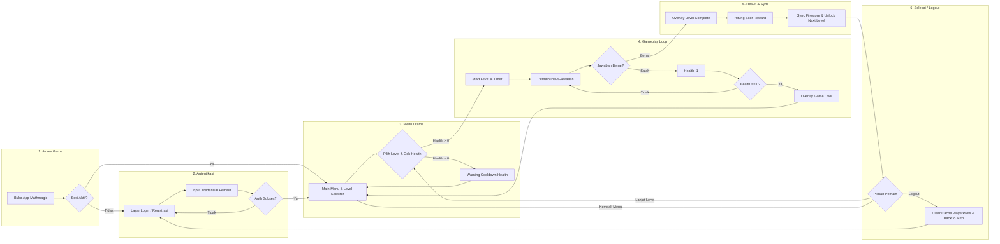
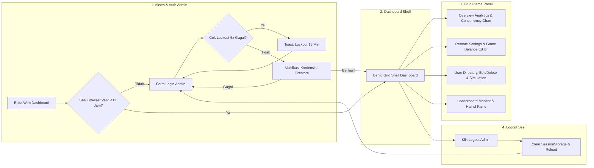

# Dokumentasi User Flow Aplikasi Mathmagic

Dokumen ini berisi panduan alur pengguna (*User Flow*) secara naratif, diagram visual Mermaid, dan langkah demi langkah (*step-by-step*) untuk proyek **Mathmagic**. Berbeda dengan diagram teknis *flowchart*, dokumen *user flow* ini berfokus pada **pengalaman pengguna (User Experience / UX)** mulai dari membuka aplikasi, proses autentikasi, permainan, hingga keluar dari aplikasi.

---

## 🎮 1. User Flow Game Client (Pemain / Player)

Alur perjalanan pemain saat memainkan game Mathmagic di perangkat Android / PC:

---

### 🟢 Langkah 1: Membuka Aplikasi & Pemeriksaan Sesi Auto-Login
* **Tampilan**: Splash Screen Mathmagic.
* **Aksi Pengguna**: Buka aplikasi game.
* **Proses Sistem**:
  1. Game melakukan inisialisasi layanan Firebase.
  2. Sistem memeriksa apakah pemain sudah pernah login sebelumnya (`CurrentUser != null`).
* **Hasil**:
  * **Jika Sudah Login**: Langsung masuk ke **Langkah 3 (Main Menu)** tanpa perlu input password lagi.
  * **Jika Belum Login**: Masuk ke **Langkah 2 (Layar Login/Registrasi)**.

---

### 🟢 Langkah 2: Registrasi & Login Pemain

#### A. Opsi Registrasi Akun Baru
1. Pemain memilih tombol **"Daftar / Register"**.
2. Pemain mengisi form:
   * Nama Lengkap
   * Username (Sistem akan memverifikasi bahwa username belum dipakai pemain lain)
   * Email Aktif (Format email tervalidasi)
   * Password & Konfirmasi Password (Minimal 6 karakter)
3. Pemain menekan tombol **"Daftar"**.
4. **Respon Sistem**: Akun baru dibuat di Firebase Auth & profil disimpan di Firestore `users`. Notifikasi sukses muncul, lalu pemain diarahkan ke Main Menu.

#### B. Opsi Login Akun Lama
1. Pemain mengisikan **Email** (atau **Username**) dan **Password**.
2. Pemain menekan tombol **"Login"**.
3. **Respon Sistem**:
   * Jika password salah / email tidak ditemukan: Muncul pesan peringatan di UI.
   * Jika berhasil: Data akun disimpan di memori lokal (`PlayerPrefs`), lalu pemain masuk ke **Langkah 3 (Main Menu)**.

---

### 🟢 Langkah 3: Main Menu & Pemilihan Level
* **Tampilan**: Menu Utama (Menampilkan Nama Pemain, Total Skor, Jumlah Nyawa/Health, dan Daftar Level).
* **Aksi Pengguna**:
  1. Pemain dapat melihat ketersediaan Nyawa/Health (Maksimal nyawa diatur dari server).
  2. Pemain memilih **Level Utama (Level 1, 2, 3...)** atau **Level Bonus**.
* **Aturan Pembukaan Level**:
  * Level 1 terbuka secara otomatis untuk pemain baru.
  * Level N hanya bisa dibuka jika Level N-1 sudah berhasil diselesaikan.
* **Respon Sistem**:
  * Jika nyawa pemain = `0`: Muncul peringatan bahwa nyawa habis dan harus menunggu waktu *cooldown* pemulihan nyawa.
  * Jika nyawa > `0`: Game memulai **Langkah 4 (Gameplay Level)**.

---

### 🟢 Langkah 4: Gameplay Loop & Pemecahan Soal Matematika
* **Tampilan**: Panggung Soal Matematika Interaktif + Timer Waktu Soal + Bar Nyawa.
* **Aksi Pengguna**: Pemain menyelesaikan soal sesuai tipe permainan yang muncul:
  1. **Matching Pairs**: Menjodohkan kartu angka/operasi yang bernilai sama.
  2. **Numpad Input**: Memasukkan jawaban angka secara langsung via Numpad UI.
  3. **Drag & Drop**: Menggeser elemen angka ke dalam kotak jawaban.
  4. **Equation Builder**: Menyusun urutan angka dan simbol matematika menjadi persamaan yang benar.
  5. **Equation Scale**: Menyeimbangkan timbangan matematika kiri dan kanan.
* **Hasil Interaksi**:
  * **Jawaban BENAR**: Efek visual kemenangan kecil muncul, skor bertambah, dan lanjut ke soal berikutnya.
  * **Jawaban SALAH / WAKTU HABIS**:
    * Nyawa berkurang -1.
    * Efek suara & visual salah muncul.
    * **Jika Nyawa Masih Ada**: Pemain dapat mencoba lagi soal tersebut.
    * **Jika Nyawa Habis (0)**: Muncul pop-up **"Game Over"** dan pemain kembali ke **Main Menu**.

---

### 🟢 Langkah 5: Penyelesaian Level & Perhitungan Skor
* **Tampilan**: Pop-Up Victory / Level Complete.
* **Aksi Pengguna**: Membaca hasil akumulasi skor yang diperoleh dari level tersebut.
* **Proses Sistem**:
  1. Skor level ditambahkan ke total skor pemain.
  2. Level berikutnya ditandai sebagai **"Terbuka" (Unlocked)** di database.
  3. **Sinkronisasi Skor**:
     * **Jika Ada Internet**: Skor langsung terkirim dan terupdate di Firestore `users`.
     * **Jika Offline**: Skor disimpan sementara di *pending cache* perangkat lokal dan akan terkirim otomatis saat internet tersambung kembali.

---

### 🟢 Langkah 6: Pilihan Lanjutan Pemain
Setelah melihat pop-up penyelesaian level, pemain memiliki 3 pilihan aksi:
1. **Tombol "Lanjut Level"**: Memulai level berikutnya secara langsung.
2. **Tombol "Menu Utama"**: Kembali ke daftar level di Main Menu.
3. **Tombol "Ulangi Level"**: Memainkan kembali level yang sama untuk mengasah nilai.

---

### 🟢 Langkah 7: Logout & Keluar Game
* **Aksi Pengguna**: Pemain menekan tombol **"Logout"** di menu pengaturan profil.
* **Proses Sistem**:
  1. Firebase Auth melakukan `SignOut()`.
  2. Sistem membersihkan seluruh data sisa akun (`PlayerPrefs` disapu bersih: `UserId`, `local_score`, `pending_score`).
  3. Sistem menghancurkan controller aktif untuk mencegah kebocoran data jika pemain lain login di HP yang sama.
  4. Layar game kembali ke **Langkah 2 (Layar Login)**.

---

## 🖥️ 2. User Flow Web Admin Dashboard (Administrator)

Alur kerja untuk admin/pengelola game melalui browser web:

---

### 🔵 Langkah 1: Akses Dashboard & Login Admin
1. Admin membuka URL Web Dashboard di browser (Vite Web App).
2. Admin mengisikan **Username** dan **Password** Admin.
3. **Fitur Keamanan Lockout**:
   * Jika Admin salah memasukkan password hingga 5 kali berturut-turut, akun akan **terkunci otomatis selama 15 menit**.
4. **Auto-Initialization**: Jika database admin masih kosong, sistem otomatis mengizinkan login default `superadmin` / `admin123` untuk penyiapan pertama kali.

---

### 🔵 Langkah 2: Navigasi Dashboard Overview (Telemetri Real-Time)
Setelah berhasil login, Admin disajikan halaman **Bento Grid Dashboard**:
* **Ringkasan Statistik**: Total Pemain Terdaftar, Rata-rata Skor, Rata-rata Level Selesai.
* **Grafik Grafik Real-Time**: Line chart puncak pemain aktif (*Peak Concurrency*) dan Peta Aktivitas Pemain (*Heatmap*).
* **Live Status**: Monitoring koneksi database Firestore & Firebase Storage.

---

### 🔵 Langkah 3: Pengaturan Remote Settings (Game Balance Editor)
Admin dapat mengatur keseimbangan permainan di Unity secara terpusat tanpa perlu merilis *update* aplikasi baru:
1. Admin membuka menu **"Settings"**.
2. Admin mengubah parameter game:
   * **Nyawa Maksimal** (misal: ubah dari 5 ke 10).
   * **Durasi Cooldown Nyawa** (detik).
   * **Batas Waktu Timer Soal** (detik).
   * **Hadiah Skor Level Utama & Bonus**.
   * **Kriteria Threshold Achievement A, B, C, D**.
3. **Hak Akses (RBAC)**:
   * `superadmin`: Diberi akses penuh untuk mengubah dan menyimpan data.
   * `admin`: Hanya dapat membaca (*Read-Only*) tanpa tombol simpan.
4. Admin klik **"Save Settings"** $\rightarrow$ Data langsung tersimpan di Firestore `settings/global` dan instan memengaruhi gameplay seluruh pemain Unity.

---

### 🔵 Langkah 4: Manajemen Pemain (User Directory)
1. Admin membuka menu **"Users"**.
2. Admin dapat mencari pemain berdasarkan Nama / Username / Email.
3. **Aksi Manajemen**:
   * **Edit User**: Mengubah skor, level, atau nyawa pemain secara manual.
   * **Delete User**: Menghapus data akun pemain dari database.
   * **Simulasi Pemain** (`superadmin` only): Membuat 5 atau 10 akun dummy otomatis untuk keperluan testing.
   * **Pembersihan Data (Purge)**: Menghapus seluruh akun dummy atau akun ber-skor `0` dengan satu klik.

---

### 🔵 Langkah 5: Monitoring Leaderboard & Peringkat
1. Admin membuka menu **"Leaderboard"**.
2. Menampilkan daftar peringkat skor tertinggi secara *real-time*.
3. Menampilkan **Hall of Fame (Pemain No. 1)** serta distribusi statistik tingkatan skor pemain.

---

### 🔵 Langkah 6: Logout Admin
1. Admin menekan tombol **"Logout"** di navigasi samping.
2. *SessionStorage* browser dibersihkan (`mm_admin_logged` dihapus).
3. Halaman otomatis dimuat ulang (*reload*) dan kembali ke form login admin.

---

## 📌 Ringkasan Singkat (Cheatsheet Alur Pengguna)

| Tahap | Pengalaman Pemain (Game Client) | Pengalaman Admin (Web Dashboard) |
|---|---|---|
| **Awal** | Buka App $\rightarrow$ Auto-Login / Form Auth | Buka Web $\rightarrow$ Form Login Admin (Proteksi Lockout 15m) |
| **Utama** | Pilih Level di Main Menu $\rightarrow$ Cek Nyawa | Tinjau Dashboard Analytics & Grafik Concurrency |
| **Aksi Core** | Main Game Soal Matematika (5 Tipe Soal) | Edit Remote Settings Game (Darah, Timer, Rewards) |
| **Hasil** | Level Complete $\rightarrow$ Tambah Skor $\rightarrow$ Sync Online/Offline | Sync Parameter ke Firebase $\rightarrow$ Kelola Akun Pemain |
| **Akhir** | Lanjut Level / Kembali ke Menu / Logout | Logout Admin (Hapus Sesi Browser) |
