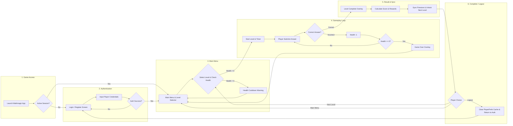
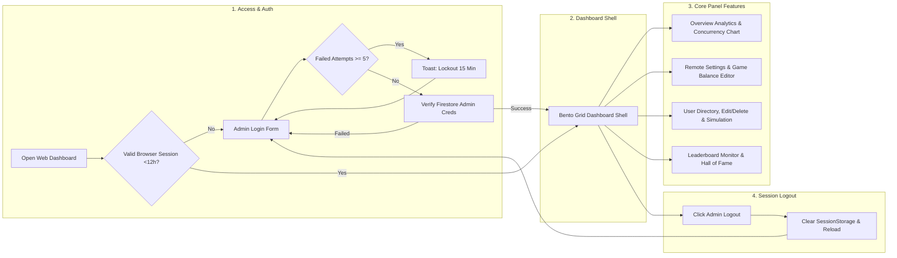

# Mathmagic User Flow Documentation

This document provides a narrative user flow guide, Mermaid visual diagrams, and step-by-step breakdowns for the Mathmagic project ecosystem. Unlike technical flowchart diagrams, this user flow document focuses on the User Experience (UX)—from launching the application, authentication, gameplay loops, to exiting.

---

## 1. Game Client User Flow (Player)

The complete player journey when playing the Mathmagic game on Android or PC:

---

### Step 1: Launching the App & Auto-Login Session Check
* **UI Screen**: Mathmagic Splash Screen.
* **User Action**: Open the game application.
* **System Process**:
  1. Game initializes Firebase App SDK services.
  2. System checks if a valid player session exists (`CurrentUser != null`).
* **Outcome**:
  * **If Logged In**: Directly transitions to Step 3 (Main Menu) without re-entering credentials.
  * **If Not Logged In**: Navigates to Step 2 (Login/Registration Screen).

---

### Step 2: Registration & Login

#### A. New Account Registration Option
1. Player taps **Register**.
2. Player fills in the registration form:
   * Full Name
   * Username (verified for uniqueness on Firestore)
   * Valid Email Address
   * Password & Password Confirmation (minimum 6 characters)
3. Player taps **Submit**.
4. **System Response**: New account created in Firebase Auth & user profile stored in Firestore `users`. Success notification displays, then user is redirected to the Main Menu.

#### B. Existing Account Login Option
1. Player enters **Email** (or **Username**) and **Password**.
2. Player taps **Login**.
3. **System Response**:
   * If credentials fail: Error toast appears on UI.
   * If successful: Account data saved to local memory (`PlayerPrefs`), player enters Step 3 (Main Menu).

---

### Step 3: Main Menu & Level Selection
* **UI Screen**: Main Menu (Displays Player Name, Total Score, Health/HP Bar, & Level Grid).
* **User Action**:
  1. Player views current Health Points (HP).
  2. Player selects an unlocked level (Level 1, 2, 3...) or Bonus Level.
* **Level Progression Rules**:
  * Level 1 is unlocked by default for new players.
  * Level N can only be unlocked after completing Level N-1.
* **System Response**:
  * If Health = `0`: Warning displays indicating health is depleted, showing a live countdown timer until HP regenerates.
  * If Health > `0`: Game transitions to Step 4 (Gameplay Loop).

---

### Step 4: Gameplay Loop & Math Problem Solving
* **UI Screen**: Interactive Math Stage + Problem Timer Slider + Health Bar.
* **User Action**: Player solves math problems across 5 interactive question types:
  1. **Matching Pairs**: Match card pairs of equal mathematical value.
  2. **Numpad Input**: Enter numerical answers directly via the custom Numpad UI.
  3. **Drag & Drop**: Drag numbers into target answer slots.
  4. **Equation Builder**: Arrange numbers and operational symbols into valid equations.
  5. **Equation Scale**: Balance left and right mathematical scales.
* **Interaction Outcome**:
  * **CORRECT Answer**: Victory particle effect plays, score increases, advances to next question.
  * **INCORRECT Answer / TIMEOUT**:
    * Health drops by -1 HP.
    * Error sound effect & red flash UI play.
    * **If HP Remains (> 0)**: Player retries the current question.
    * **If HP Depleted (0)**: Game Over overlay displays and player returns to Main Menu.

---

### Step 5: Level Completion & Score Calculation
* **UI Screen**: Victory / Level Complete Overlay.
* **User Action**: View accumulated score breakdown and star rewards earned for the level.
* **System Process**:
  1. Level score added to player's total cumulative score.
  2. Next level status set to **Unlocked** in database.
  3. **Score Synchronization**:
     * **Online**: Score immediately updates to Cloud Firestore `users`.
     * **Offline**: Score cached locally in `PlayerPrefs` pending queue, auto-syncing when internet restores.

---

### Step 6: Post-Level Options
After viewing the victory overlay, player has 3 action choices:
1. **Next Level Button**: Instantly launch the next unlocked level.
2. **Main Menu Button**: Return to the level selection grid in the Main Menu.
3. **Replay Button**: Replay the current level to improve score and star rating.

---

### Step 7: Logout & Exit
* **User Action**: Tap **Logout** in the profile settings panel.
* **System Process**:
  1. Firebase Auth executes `SignOut()`.
  2. System purges all cached local user data (`PlayerPrefs`: `UserId`, `local_score`, `pending_score`).
  3. System resets controllers to prevent cross-account data leakage on shared devices.
  4. Screen returns to Step 2 (Login Screen).

---

## 2. Web Admin Dashboard User Flow (Administrator)

Administrator workflow when managing the game ecosystem via a web browser:

---

### Step 1: Dashboard Access & Admin Authentication
1. Admin opens the Web Dashboard URL in a web browser (Vite Web App).
2. Admin inputs **Username** and **Password**.
3. **Security Lockout Feature**:
   * 5 consecutive failed login attempts trigger an automatic 15-minute account lockout.
4. **Auto-Initialization**: If the admin collection is empty, default credentials `superadmin` / `admin123` are permitted for initial system setup.

---

### Step 2: Dashboard Overview Navigation (Real-Time Telemetry)
Upon successful authentication, Admin is presented with the Bento Grid Dashboard:
* **Statistical Metrics**: Total Registered Players, Average Score, Completion Rate.
* **Real-Time Charts**: Peak Concurrency line charts & Player Activity Heatmap.
* **Live Status**: Real-time connection monitoring for Firestore & Firebase Storage services.

---

### Step 3: Remote Settings (Game Balance Editor)
Admin manages Unity game parameters centrally without releasing app updates:
1. Admin opens **Settings**.
2. Admin edits game parameters:
   * **Max Health / HP** (e.g., adjust from 5 to 10).
   * **HP Cooldown Duration** (seconds).
   * **Question Timer Limit** (seconds).
   * **Main Level & Bonus Score Rewards**.
   * **Achievement Thresholds A, B, C, D**.
3. **Role-Based Access Control (RBAC)**:
   * `superadmin`: Full read/write access.
   * `admin`: Read-only view without save permissions.
4. Admin clicks **Save Settings** $\rightarrow$ Data updates instantly in Firestore `settings/global` and immediately affects live Unity gameplay sessions.

---

### Step 4: Player Management (User Directory)
1. Admin opens **Users**.
2. Search players by Name / Username / Email.
3. **Management Actions**:
   * **Edit User**: Manually modify player scores, levels, or health.
   * **Delete User**: Remove player account document from Firestore.
   * **Simulate Players** (`superadmin` only): Auto-generate 5 or 10 dummy accounts for load testing.
   * **Purge Data**: Delete all dummy accounts or accounts with `0` score in a single click.

---

### Step 5: Leaderboard & Ranking Monitoring
1. Admin opens **Leaderboard**.
2. View real-time top player score rankings.
3. View Hall of Fame (Rank #1 Player) and score distribution analytics.

---

### Step 6: Admin Logout
1. Admin clicks **Logout** in the sidebar navigation.
2. Browser *SessionStorage* is cleared (`mm_admin_logged` destroyed).
3. Page reloads and returns to the Admin Login Form.

---

## User Flow Summary Cheatsheet

| Stage | Player Experience (Unity Client) | Admin Experience (Web Dashboard) |
|---|---|---|
| **Entry** | Launch App $\rightarrow$ Auto-Login / Auth Form | Open Web $\rightarrow$ Admin Login (15m Lockout Protection) |
| **Main** | Select Level in Main Menu $\rightarrow$ Check HP | Review Bento Grid Telemetry & Concurrency Charts |
| **Core Action**| Play Math Gameplay (5 Problem Types) | Edit Remote Game Balance (HP, Timers, Rewards) |
| **Result** | Level Complete $\rightarrow$ Add Score $\rightarrow$ Sync Cloud/Offline | Sync Parameters to Firebase $\rightarrow$ Manage Player Accounts |
| **Exit** | Next Level / Main Menu / Logout | Admin Logout (Destroy Browser Session) |
