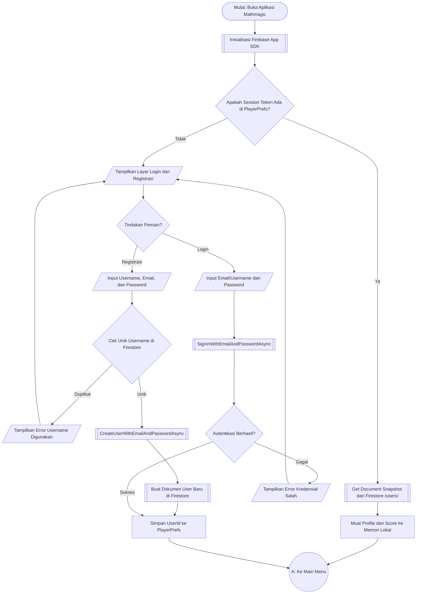
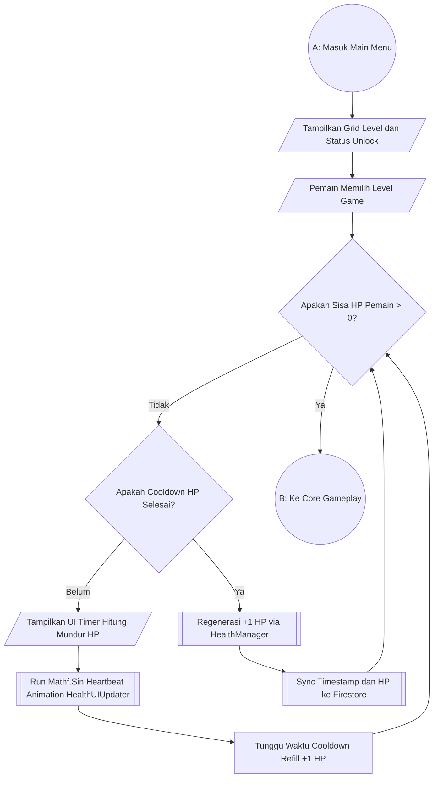
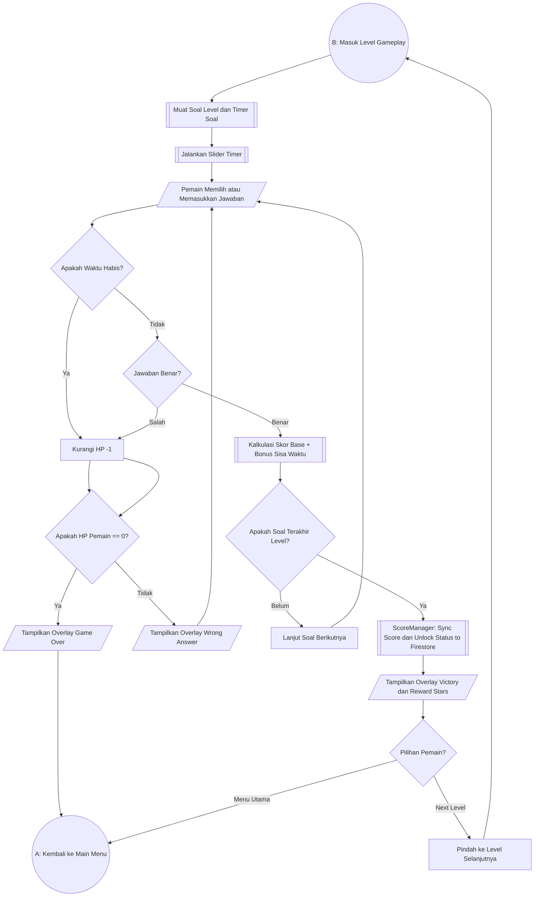
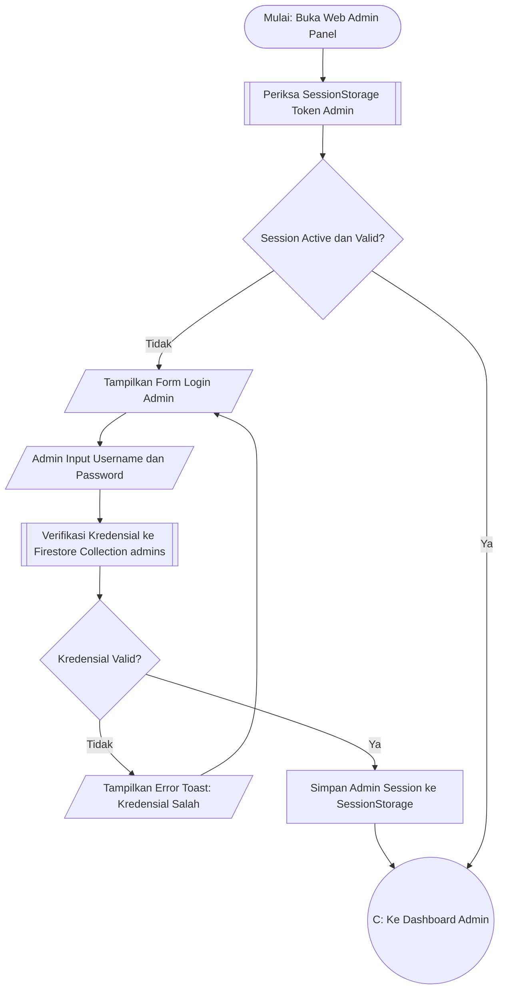
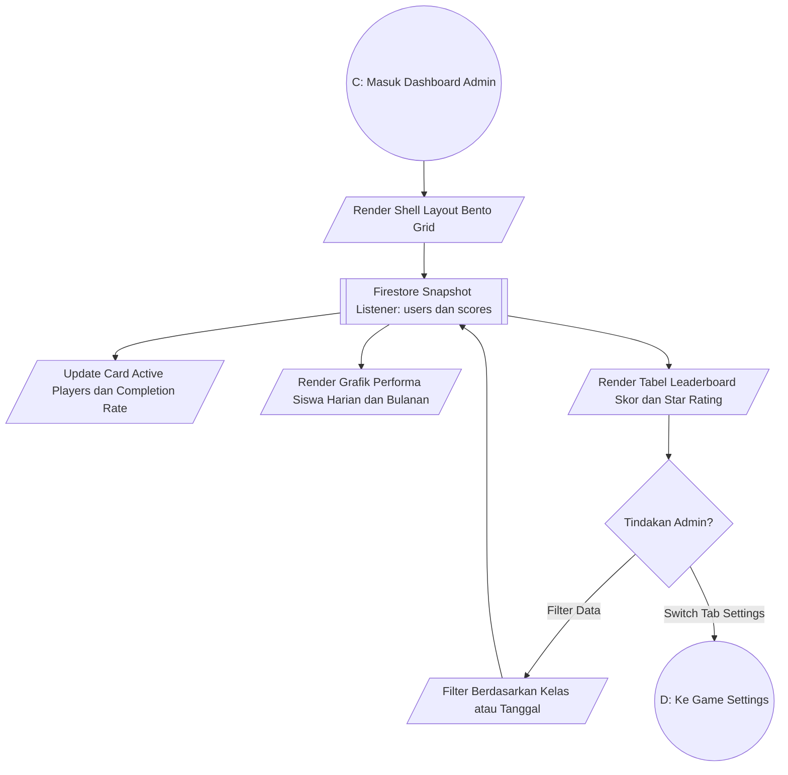
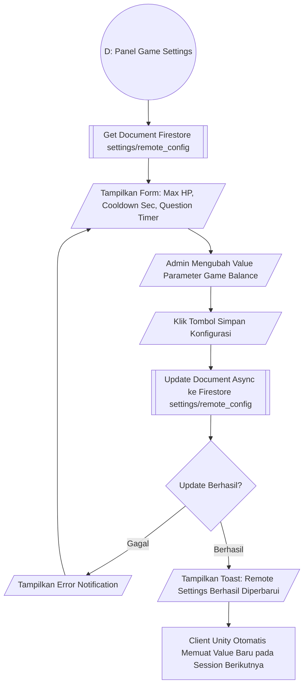

# Mathmagic: Educational Game & Web Admin Dashboard

[](https://unity.com/)
[](https://firebase.google.com/)
[](https://vitejs.dev/)
[](LICENSE)

**Mathmagic** adalah ekosistem aplikasi game edukasi berbasis matematika interaktif yang dirancang untuk siswa sekolah dasar/menengah, terintegrasi secara *real-time* dengan cloud backend dan panel kendali berbasis web bagi guru/administrator.

---

## Ringkasan Ekosistem Sistem

Ekosistem **Mathmagic** terbagi menjadi 2 komponen utama:
1. **Game Client (Mobile Application)**: Ditingkatkan dengan game engine **Unity 6 (v6000.0.35f1 LTS)** untuk memberikan pengalaman bermain game berkinerja tinggi, visual dinamis, serta kalkulasi matematika interaktif.
2. **Web Admin Dashboard**: Dibuat menggunakan **Vite + JavaScript (ES6)** & **Firebase SDK**, menyediakan antarmuka *Bento Grid* modern untuk memantau performa siswa, memantau papan peringkat (*leaderboard*), dan mengubah *game balance* secara *live* dari jarak jauh.

```
                    +-------------------------------------+
                    |       Cloud Firebase Service        |
                    |  (Firestore DB & Authentication)    |
                    +------------------+------------------+
                                       |
                +----------------------+----------------------+
                |                                             |
                v                                             v
  +---------------------------+                 +---------------------------+
  |     Unity Game Client     |                 |    Web Admin Dashboard    |
  |  (Mobile App - Unity 6)   |                 | (Vite + Vanilla JS + CSS) |
  +---------------------------+                 +---------------------------+
```

---

## 1. Unity Game Client (Mobile Application)

### Spesifikasi Teknis App
* **Engine Version**: Unity 6 (`6000.0.35f1 LTS`)
* **Bahasa**: C# (.NET Standard 2.1)
* **Penyimpanan Lokal**: `PlayerPrefs` (Cache offline & isolasi data akun)
* **Konektivitas Cloud**: Firebase Auth SDK & Firebase Firestore NoSQL DB
* **Optimasi UI/Animation**: Pemrosesan gelombang matematika sinusoidal (`Mathf.Sin`) pada `HealthUIUpdater.cs` untuk efek *heartbeat* UI tanpa membebani GPU/memori perangkat mobile.

### Struktur Folder Kunci Client (`/Assets`)
```
Assets/
├── 1 Script/
│   ├── Level Script/          # Komponen pengatur level, timer, & overlay
│   │   ├── LevelManager.cs
│   │   ├── Timer.cs
│   │   └── OverlayManager.cs
│   ├── Login Register Script/ # Autentikasi & manajemen sesi pemain
│   │   ├── FirebaseAuthController.cs
│   │   └── DoLogout.cs
│   ├── Score/                 # Pengelola skor, HP, & sinkronisasi Firestore
│   │   ├── ScoreManager.cs
│   │   ├── ProfileManager.cs
│   │   └── New/
│   │       ├── HealthManager.cs
│   │       └── HealthUIUpdater.cs
│   └── Web Admin Interop/    # Pengambil konfigurasi jarak jauh
│       └── RemoteSettingsManager.cs
```

---

### Diagram Flowchart Game Client (Terpisah per Modul)

#### Flowchart 1.1: Autentikasi & Restorasi Sesi Pemain (`FirebaseAuthController.cs`)
Flowchart ini menjelaskan alur saat aplikasi pertama kali dibuka, pengecekan sesi terautentikasi, validasi kredensial, hingga pemuatan profil pemain dari Cloud Firestore.



---

#### Flowchart 1.2: Navigasi Level & Cooldown HP (`LevelManager.cs` & `HealthManager.cs`)
Flowchart ini memvisualisasikan alur pemilihan level game dan verifikasi sisa nyawa (HP) yang dikalibrasi berbasis *UTC timestamp*.



---

#### Flowchart 1.3: Core Gameplay & Sinkronisasi Skor (`ScoreManager.cs` & `Timer.cs`)
Flowchart ini menangani siklus soal permainan, evaluasi jawaban, pengurangan HP saat salah, serta penyimpanan skor otomatis ke Firestore saat menang.



---

## 2. Web Admin Dashboard

### Spesifikasi Teknis Web Admin
* **Bundler / Framework**: Vite (Vanilla ES6 JavaScript)
* **Styling**: Modern CSS Glassmorphism + Layouting **Bento Grid**
* **Database & Auth**: Firebase Web SDK v10+ (Firestore & Authentication)
* **Fitur Utama**: Analisis Statistik Siswa, Leaderboard Real-time, Remote Game Balance Manager.

### Struktur Folder Kunci Web Admin (`/Web Dashboard`)
```
Web Dashboard/
├── index.html              # Shell HTML utama & struktur Bento Grid
├── main.js                 # Logika controller aplikasi & komunikasi Firestore
├── styles.css              # Custom styling Glassmorphism & layout Bento Grid
├── package.json            # Berkas konfigurasi npm & dependensi
└── vite.config.js          # Konfigurasi bundler Vite
```

---

### Diagram Flowchart Web Admin (Terpisah per Modul)

#### Flowchart 2.1: Autentikasi Admin & Proteksi Sesi (`main.js`)
Flowchart ini mengatur alur autentikasi admin, pembatasan hak akses (*Role-Based Access Control*), dan mekanisme proteksi sesi *SessionStorage*.



---

#### Flowchart 2.2: Bento Grid Analytics & Leaderboard Real-time
Flowchart ini menjelaskan alur *live streaming* data siswa dari Firestore ke panel antarmuka Bento Grid.



---

#### Flowchart 2.3: Remote Game Balance & Settings Manager
Flowchart ini memvisualisasikan alur pengubahan parameter keseimbangan game secara *live* tanpa perlu melakukan *re-build* pada Game Client Unity.



---

## 3. Panduan Instalasi & Menjalankan Proyek

### A. Menjalankan Game Client (Unity 6)
1. Buka **Unity Hub**, pilih **Add project from disk**.
2. Arahkan ke direktori proyek utama `Mathmagic-New`.
3. Pastikan menggunakan Unity Version **`6000.0.35f1 LTS`**.
4. Buka scene utama di folder `Assets/Scenes/MainLoginScene.unity`.
5. Tekan tombol **Play** di Unity Editor untuk menjalankan simulasi.

### B. Menjalankan Web Admin Dashboard (Lokal)
1. Buka terminal/cmd dan masuk ke folder `Web Dashboard`:
   ```bash
   cd "Web Dashboard"
   ```
2. Install seluruh dependensi npm:
   ```bash
   npm install
   ```
3. Jalankan server pengembangan lokal (*development server*):
   ```bash
   npm run dev
   ```
4. Buka tautan lokal yang tampil pada terminal (biasanya `http://localhost:5173`).

---

## 4. Dokumentasi Terkait

Seluruh dokumentasi teknis, standar ISO 5807, dan berkas laporan proyek tersimpan di direktori [`/Doc`](./Doc):

| Nama Berkas Dokumentasi | Deskripsi Berkas |
| :--- | :--- |
| [`Doc/FLOWCHART_DOCUMENTATION.md`](./Doc/FLOWCHART_DOCUMENTATION.md) | Master indeks dokumentasi flowchart lengkap & standar ISO 5807. |
| [`Doc/Flowchart_Game_Dokumen.docx`](./Doc/Flowchart_Game_Dokumen.docx) | Dokumen Microsoft Word resmi berisi diagram alir game & penjelasan rinci. |
| [`Doc/Flowchart_Game.md`](./Doc/Flowchart_Game.md) | Dokumentasi rinci alur logika teknis Game Client Unity. |
| [`Doc/Flowchart_WebAdmin.md`](./Doc/Flowchart_WebAdmin.md) | Dokumentasi rinci alur logika teknis Web Admin Dashboard. |
| [`Doc/Laporan_HKI_SourceCode.docx`](./Doc/Laporan_HKI_SourceCode.docx) | Berkas Word resmi konsolidasi kode program utama untuk pengajuan Hak Cipta (HKI). |
| [`Doc/USER_FLOW.md`](./Doc/USER_FLOW.md) | Panduan naratif alur pengalaman pengguna (UX Journey). |

---

<p center="align">
  <i>Developed for Mathmagic Educational Project &copy; 2026. All Rights Reserved.</i>
</p>
